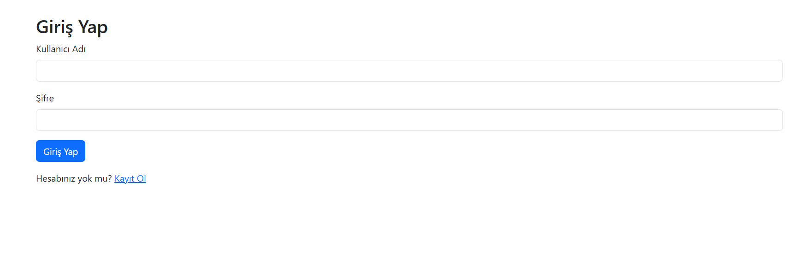
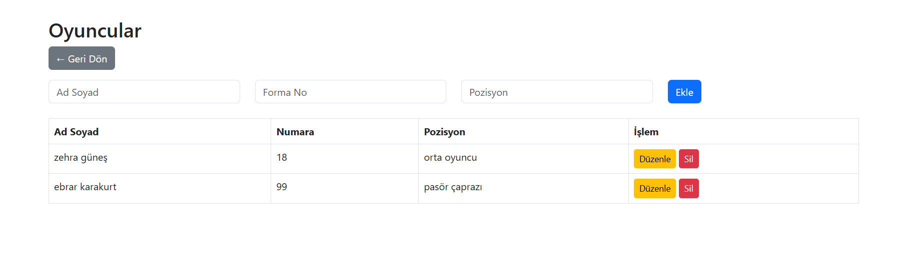
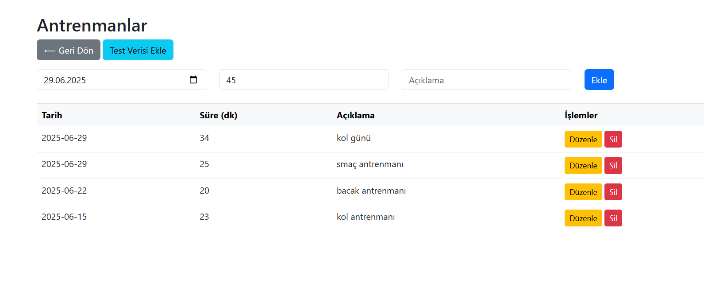
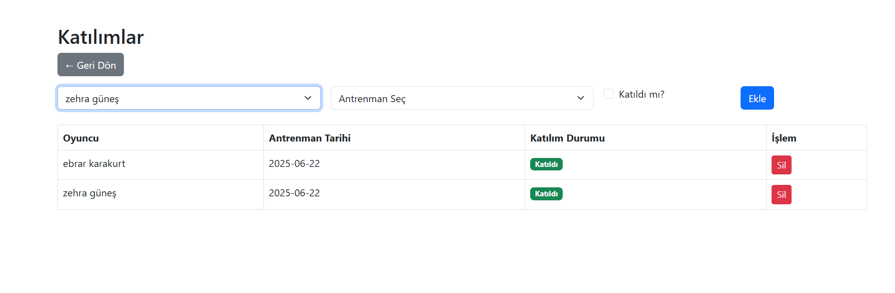

# 🏐 Voleybol Takımı Yönetim ve Antrenman Takip Sistemi

Bu proje, bir voleybol takımının oyuncularını, antrenmanlarını ve katılım durumlarını yönetmek için geliştirilmiş, PHP ve MySQL tabanlı bir web uygulamasıdır. Uygulama kullanıcı girişi gerektirir ve kullanıcı giriş yaptıktan sonra oyuncuların, antrenmanların ve katılım bilgilerinin takibini sağlar.

📌 **Canlı Uygulama Bağlantısı:**  
🔗 [http://95.130.171.20/~st22360859070/voleybol/login.php](http://95.130.171.20/~st22360859070/voleybol/login.php)

---

## 🎥 Tanıtım Videosu

[](https://www.youtube.com/watch?v=VIDEO_ID)

> 📌 Videoyu yükledikten sonra `VIDEO_ID` kısmını YouTube video ID’si ile değiştir.

---

## 📸 Ekran Görüntüleri

### 1. 🔐 Giriş Sayfası


### 2. 🏠 Dashboard


### 3. 📋 Oyuncular Listesi


### 4. 🗓️ Antrenman Ekleme Sayfası


> Not: Bu görsellerin doğru görünmesi için `screenshots/` klasörünü projenle birlikte sunucuda barındırmalı veya GitHub’a yüklemelisin.

---

## 🗄️ Veritabanı Yapısı

```sql
CREATE TABLE kullanicilar (
    id INT AUTO_INCREMENT PRIMARY KEY,
    kullanici_ad VARCHAR(50) NOT NULL UNIQUE,
    sifre VARCHAR(255) NOT NULL
);

CREATE TABLE oyuncular (
    id INT AUTO_INCREMENT PRIMARY KEY,
    ad_soyad VARCHAR(100) NOT NULL,
    numara INT NOT NULL,
    pozisyon VARCHAR(50) NOT NULL
);

CREATE TABLE antrenmanlar (
    id INT AUTO_INCREMENT PRIMARY KEY,
    tarih DATE NOT NULL,
    sure_dk INT NOT NULL,
    aciklama VARCHAR(100) NOT NULL
);

CREATE TABLE katilimlar (
    id INT AUTO_INCREMENT PRIMARY KEY,
    oyuncu_id INT NOT NULL,
    antrenman_id INT NOT NULL,
    katildi_mi TINYINT(1) NOT NULL DEFAULT 0,
    FOREIGN KEY (oyuncu_id) REFERENCES oyuncular(id) ON DELETE CASCADE,
    FOREIGN KEY (antrenman_id) REFERENCES antrenmanlar(id) ON DELETE CASCADE
);
```

---

## 📁 Klasör Yapısı

```
voleybol/
├── config/
│   └── db.php
├── includes/
│   ├── header.php
│   └── footer.php
├── antrenmanlar.php
├── dashboard.php
├── index.php
├── katilimlar.php
├── login.php
├── logout.php
├── oyuncular.php
├── register.php
├── setup_database.php
├── sql.txt
└── style.css
```

---

## 👩‍💻 Geliştirici Bilgileri

- **Adı:** Rumeysa Ersoy  
- **Ders:** Web Tabanlı Programlama  
- **GitHub:** [github.com/rumeysaersoyy](https://github.com/rumeysaersoyy)

---

## 📄 Lisans

Bu proje yalnızca bireysel ve eğitim amaçlıdır. Ticari kullanım için geliştiriciden izin alınmalıdır.
